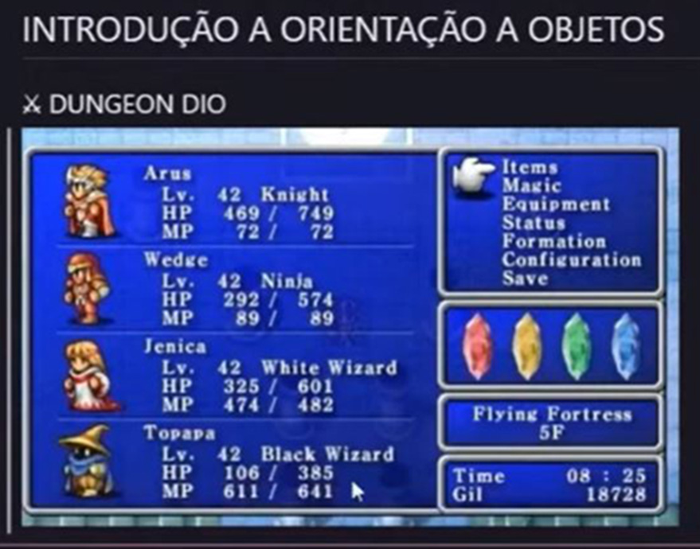

# Desafio_Abstraindo um Jogo de RPG Usando Orientação a Objetos com C#

Desafio de projeto lançado na plataforma DIO para o Bootcamp “Geração Tech Unimed-BH | Fullstack”

O desafio propunha criar uma abstração simples de um jogo RPG em C# utilizando os pilares da Programação Orientada a Objeto.

Screenshot do modelo proposto com nome dos personagens e suas características:

